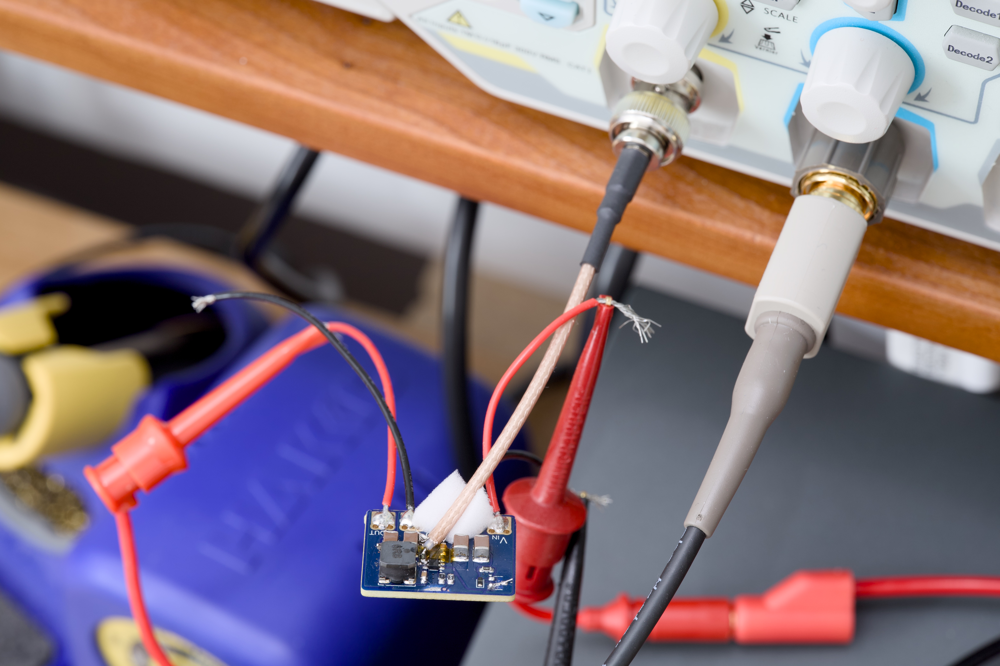
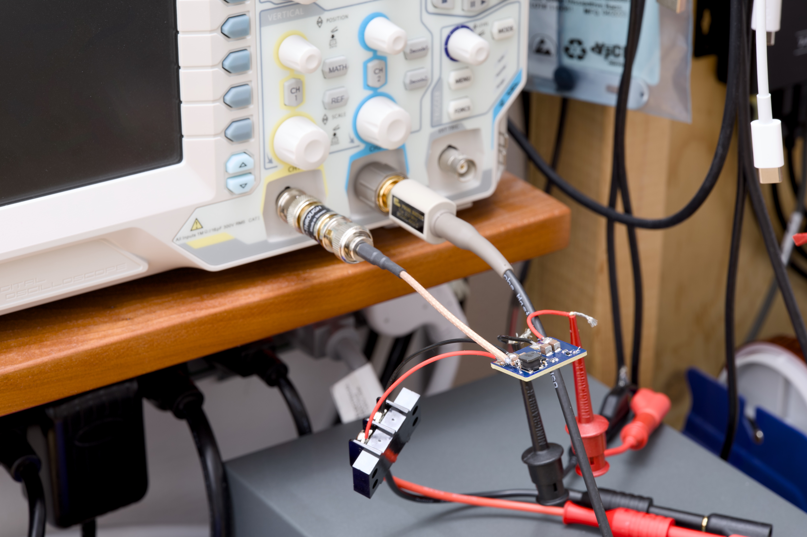
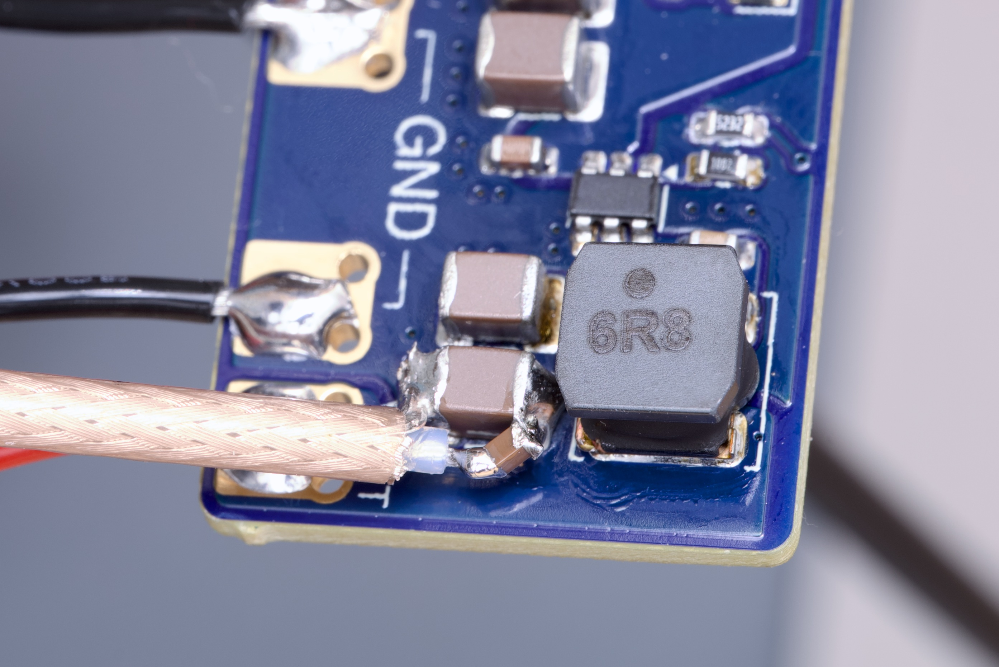

# 4.3V to 60V input / 0.8V to 30V output switching converter

## Switch node analysis

50 ohms series termination at the SW node.

### Switch node

| Input Voltage | Waveform | Rising edge |
|---------------|----------|-------------|
| 10V           |  |  |
| 20V           |  |  |
| 48V           |  |  |

## Output analysis

### Probe setup

Output capacitors -> 1uF capacitor -> 10 cm RG316 coax -> 50 ohms feed through termination

### 5V output / ~Max current

| Input voltage (V) | Current (A) | Temperature (°C)                                   | Noise (mVp-p) | Noise (%) | | |
|-------------------|-------------|----------------------------------------------------|---------------|-----------|-|-|
| 8                 | 2           | [59.8](assets/img/noise_5V/temperature_8V2A.jpg)   | 40            | 0.8       |||
| 10                | 2           | [60.8](assets/img/noise_5V/temperature_10V2A.jpg)  | 42.4          | 0.848     |||
| 20                | 1.5         | [62](assets/img/noise_5V/temperature_20V15A.jpg)   | 66.4          | 1.328     |||
| 24                | 1.2         | [61.8](assets/img/noise_5V/temperature_24V12A.jpg) | 72.8          | 1.456     |||
| 48                | 0.4         | [60.1](assets/img/noise_5V/temperature_48V04A.jpg) | 127.2         | 2.544     |||
