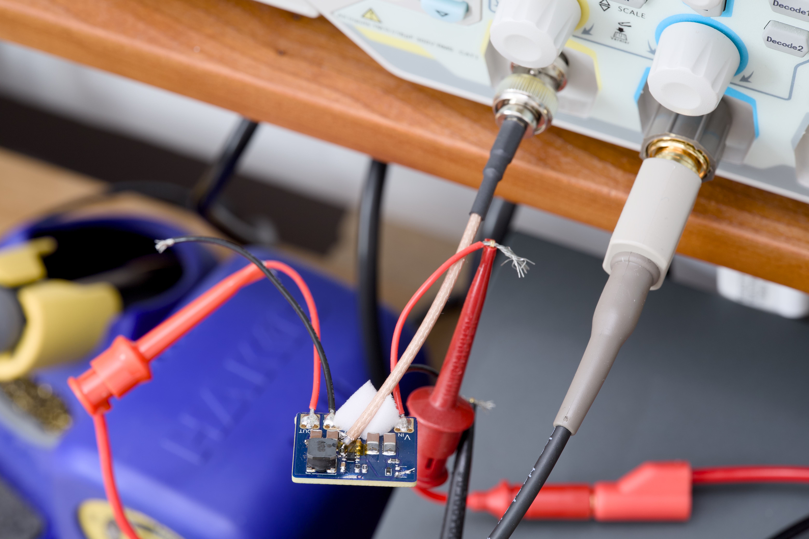
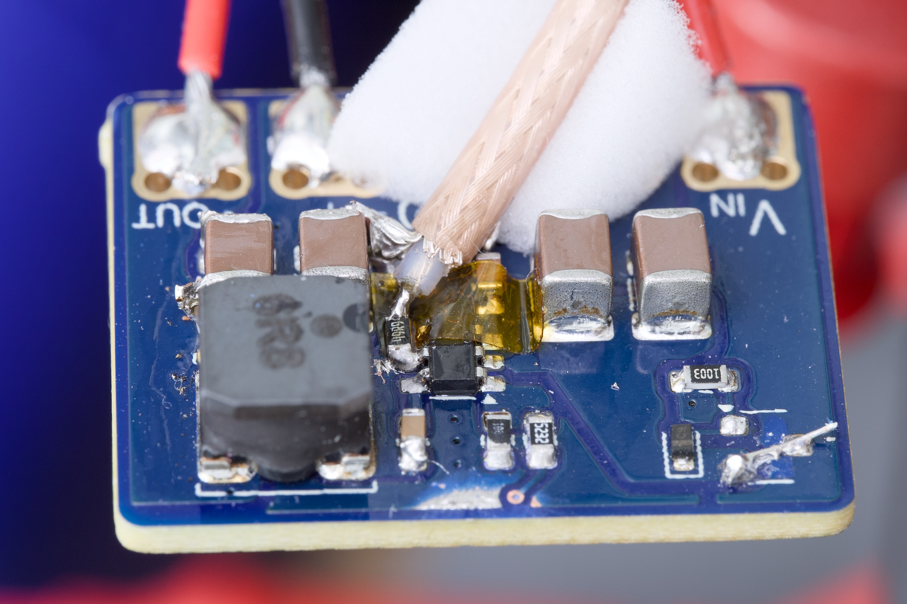
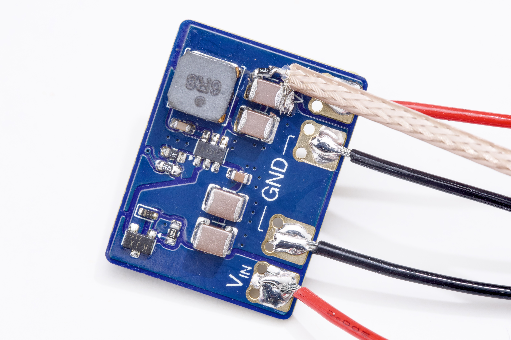
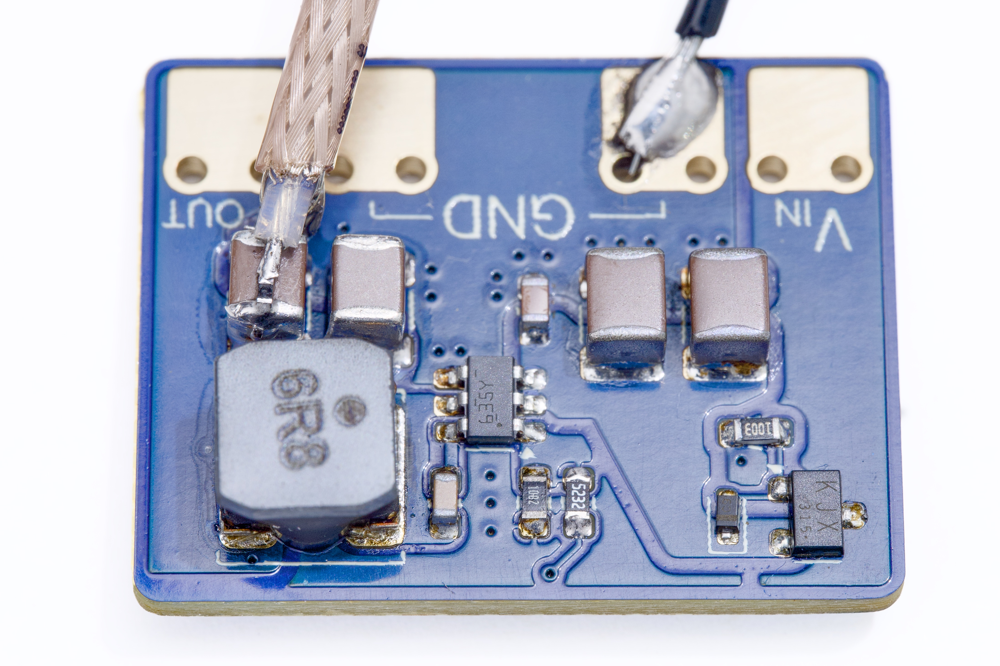
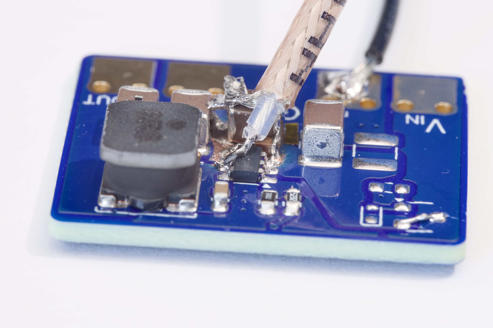

# 4.3V to 60V input / 0.8V to 30V output switching converter

- [PCB v1.0.0-5-g07f53f4](#pcb-v100-5-g07f53f4)
  - [Switching converter analysis](#switching-converter-analysis)
    - [Switch node](#switch-node)
  - [Output (5V, 2x 10uF 50V output capacitors)](#output-5v-2x-10uf-50v-output-capacitors)
  - [Output (5V, 2x 22uF 16V output capacitors)](#output-5V-2x-22uF-16V-output-capacitors)
- [PCB v1.0.0-5-g07f53f4 (hack1)](#pcb-v100-5-g07f53f4-hack1)
  - [Switching converter analysis](#switching-converter-analysis-lmr51625)
  - [Output (5V, 2x 22uF 16V output capacitors)](#output-5V-lmr51625-2x-22uF-16V-output-capacitors)

## PCB v1.0.0-5-g07f53f4

### Switching converter analysis

50 ohms series termination at the SW node.

#### Switch node

| Input Voltage | Waveform | Rising edge |
|---------------|----------|-------------|
| 10V           |  |  |
| 20V           |  |  |
| 48V           |  |  |

### Output (5V, 2x 10uF 50V output capacitors)

| Input Voltage | No Load | 50 mA | 500 mA | 1 A |
|---------------|---------|-------|--------|-----|
| 10V           |  |  |  |  |
| 20V           |  |  |  |  |
| 48V           |  |  |  |  |

| Input Voltage | No Load | 50 mA | 500 mA | 1 A |
|---------------|---------|-------|--------|-----|
| 10V           |  |  |  |  |
| 20V           |  |  |  |  |
| 48V           |  |  |  |  |

#### Noise

| Input Voltage | No Load | 50 mA | 500 mA | 1 A |
|---------------|---------|-------|--------|-----|
| 10V           | 73.60 mV (1.47%) | 73.60 mV (1.47%) | 20.80 mV (0.42%) | 19.20 mV (0.38%) |
| 20V           | 49.20 mV (0.98%) | 49.20 mV (0.98%) | 26.00 mV (0.52%) | 27.20 mV (0.54%) |
| 48V           | 49.20 mV (0.98%) | 49.20 mV (0.98%) | 45.20 mV (0.90%) | 40.40 mV (0.81%) |

### Output (5V, 2x 22uF 16V output capacitors)

| Input Voltage | No Load | 50 mA | 500 mA | 1 A |
|---------------|---------|-------|--------|-----|
| 10V           |  |  |  |  |
| 20V           |  |  |  |  |
| 48V           |  |  |  |  |

| Input Voltage | No Load | 50 mA | 500 mA | 1 A |
|---------------|---------|-------|--------|-----|
| 10V           |  |  |  |  |
| 20V           |  |  |  |  |
| 48V           |  |  |  |  |

#### Noise

| Input Voltage | No Load | 50 mA | 500 mA | 1 A |
|---------------|---------|-------|--------|-----|
| 10V           | 31.40 mV (0.63%) | 32.40 mV (0.65%) | 16.40 mV (0.33%) | 15.20 mV (0.30%) |
| 20V           | 22.80 mV (0.46%) | 24.40 mV (0.49%) | 19.60 mV (0.39%) | 19.20 mV (0.38%) |
| 48V           | 23.60 mV (0.47%) | 26.20 mV (0.52%) | 21.00 mV (0.42%) | 21.20 mV (0.42%) |

### Output (24V, 2x 10uF 50V output capacitors)

| Input Voltage | No Load | 50 mA | 500 mA | 1 A |
|---------------|---------|-------|--------|-----|
| 10V           |  |  |  |  |
| 20V           |  |  |  |  |
| 48V           |  |  |  |  |

| Input Voltage | No Load | 50 mA | 500 mA | 1 A |
|---------------|---------|-------|--------|-----|
| 10V           |  |  |  |  |
| 20V           |  |  |  |  |
| 48V           |  |  |  |  |

#### Noise

| Input Voltage | No Load | 50 mA | 500 mA | 1 A |
|---------------|---------|-------|--------|-----|
| 10V           |  mV (%) |  mV (%) |  mV (%) |  mV (%) |
| 20V           |  mV (%) |  mV (%) |  mV (%) |  mV (%) |
| 48V           |  mV (%) |  mV (%) |  mV (%) |  mV (%) |

## PCB v1.0.0-5-g07f53f4 (hack1)

### Switching converter analysis (LMR51625)

50 ohms series termination at the SW node.

#### Switch node

| Input Voltage | Waveform | Rising edge |
|---------------|----------|-------------|
| 10V           |  |  |
| 20V           |  |  |
| 48V           |  |  |

### Output (5V, LMR51625, 2x 22uF 16V output capacitors)

| Input Voltage | No Load | 50 mA | 500 mA | 1 A |
|---------------|---------|-------|--------|-----|
| 10V           |  |  |  |  |
| 20V           |  |  |  |  |
| 48V           |  |  |  |  |

| Input Voltage | No Load | 50 mA | 500 mA | 1 A |
|---------------|---------|-------|--------|-----|
| 10V           |  |  |  |  |
| 20V           |  |  |  |  |
| 48V           |  |  |  |  |

#### Noise

| Input Voltage | No Load | 50 mA | 500 mA | 1 A |
|---------------|---------|-------|--------|-----|
| 10V           | mV (%) | mV (%) | mV (%) | mV (%) |
| 20V           | mV (%) | mV (%) | mV (%) | mV (%) |
| 48V           | mV (%) | mV (%) | mV (%) | mV (%) |
